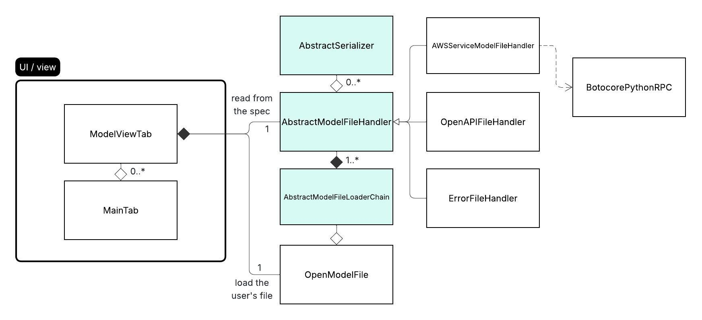

# Contributing to Model Parser

## Development Setup

### Prerequisites

* **JDK 21+** - Required for building the extension
* **Python ≥3.8** - Required for AWS JSON model support (optional)
* **IntelliJ IDEA** - For UI development (optional)

### Getting Started

1. **Clone the repository**
   ```bash
   git clone <repo-url>
   cd model-parser
   ```

2. **Build the project**
   ```bash
   gradlew shadowJar
   ```
   The fat JAR will be output to `build/libs/si-model-parse-x.x.x-all.jar`

3. **Load in Burp Suite**
   - Open Burp Suite → Extensions → Add
   - Select the generated JAR file

## Development Workflow

### Protobuf

If you modify `.proto` files, regenerate the protobuf classes:

```bash
gradlew generateProto
```

### Building

Build the fat JAR with gradle shadow:

```bash
gradlew shadowJar
```

## Project Architecture

### Class Diagram



### Key Components

- **Model File Loaders** - Parse and load API spec files
- **Model File Handlers** - Process and serialize API operations
- **UI Components** - Burp Suite extension interface
- **gRPC Server** - Python service for AWS botocore serialization

## UI Development

UI `.form` files are built with IntelliJ's GUI Designer with the option:
**"Generate into: Java source code on save"**

## Adding Support for New API Specs

Follow these steps to add support for a new API specification format:

1. **Implement the loader**
   - Create a new class extending [AbstractModelFileLoaderChain](src/main/java/com/securityinnovation/simodelparse/control/file/loader/AbstractModelFileLoaderChain.java)
   - This loads the model file and acts as an adapter

2. **Implement the handler**
   - Create a new class extending [AbstractModelFileHandler](src/main/java/com/securityinnovation/simodelparse/control/file/handler/AbstractModelFileHandler.java)
   - This processes and serializes the API operations

3. **Register the loader**
   - Add your new loader to the `modelFileLoaderChain` in [OpenModelFile](src/main/java/com/securityinnovation/simodelparse/model/OpenModelFile.java)

## Reporting Issues

When reporting bugs, please include:

- Steps to reproduce
- Expected vs actual behavior
- Sample spec file (if possible)
- Error messages or stack traces

