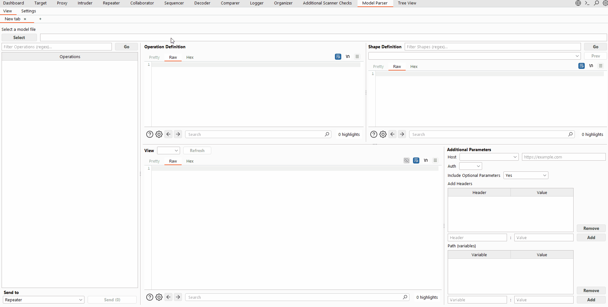

# Burp API Spec Parser

[](https://github.com/bvcyber/Model-Parser/releases/latest)


> **Transform API specs into ready-to-test requests in seconds.** Start pentesting directly from specs. Import OpenAPI, Swagger, or AWS JSON API specs directly into Burp. Send all APIs to Repeater, Intruder, Sitemap, and more with a single-click. 

<div align="center">



[Quick Start](#-quick-start) • [Features](#-why-model-parser) • [Setup Guide](#-setup) • [Documentation](#-basic-workflow)

</div>


---

## 💡 Features

- **🎯 Reduce manual request crafting** – Import your spec and skip straight to security testing
- **🔄 Multi-format support** – OpenAPI, Swagger, AWS JSON, MCP models all in one tool
- **⚡ Instant integration** – One-click send to Repeater, Intruder, Organizer, Sitemap

**🚀 Import → Click → Test**

---

## ⚡ Quick Start

1. Download the [latest JAR](https://github.com/bvcyber/Model-Parser/releases)
2. Load into Burp Suite Extensions
3. Import your spec file
4. Start testing! 🎉

> **💡 Note:** For AWS JSON models, you'll need the Python server running – see [AWS JSON Setup](#aws-json-setup)

---

## 🎯 Supported Formats

| Format                      | Status                    | Notes                                                                                                                                                                |
|-----------------------------|---------------------------|----------------------------------------------------------------------------------------------------------------------------------------------------------------------|
| **OpenAPI 3.0 / 3.1**       | ✅ Supported               | JSON & YAML<br>• Generates requests per content type                                                                                                                 |
| **Swagger 2.0**             | ✅ Supported               | JSON & YAML<br>• Generates requests per content type                                                                                                                 |
| **AWS JSON (Botocore)**     | ✅ Supported               | [Requires Python server](#aws-json-setup)<br>• Generate HTTP or awscli requests<br/>📦 [Source models](https://github.com/boto/botocore/tree/develop/botocore/data/) |
| **MCP Servers Config JSON** | ✅ Supported               | `sse` & `http` type<br>• Calls `tools/list` on each server and stores it in memory<br>• Generates requests for each tool and server capability                       |
| **AWS Smithy**              | ❌ Not currently supported |                                                                                                                                                                      |

---

## ⚙️ Setup

### Extension Installation

1. Download the JAR from [releases](https://github.com/bvcyber/Model-Parser/releases)
2. Open Burp Suite → **Extensions** tab → **Add**
3. Select the downloaded JAR file
4. Find the API Spec Parser tab in Burp

### OpenAPI / Swagger Setup

**No additional setup needed!** Just load your spec file and start testing.     

### MCP Servers Config Setup

API Spec Parser parses the `type`, `url`, and `headers` fields. It uses these values to connect to the servers and call `tools/list`.

### AWS JSON Setup

AWS JSON models (e.g. [service-2.json files](https://github.com/boto/botocore/tree/develop/botocore/data/)) require setting up the Python server for serialization.

Choose your preferred method:

#### Docker (Recommended)

**Requirements:** Docker Desktop

```bash
# Clone the repository
git clone <repo-url>
cd burp-api-spec-parser

# Build the image
docker build -t apiparserservice .

# Run on default port (50055)
docker run -p 50055:50055 apiparserservice 50055

# Or customize the port
docker run -p 8080:8080 apiparserservice 8080
```

#### Local Python Setup

**Requirements:** Python ≥3.8, pip

```bash
# Install dependencies
python -m pip install -r requirements.txt

# Or install individually
python -m pip install grpcio-tools~=1.75.1
python -m pip install botocore~=1.40.40

# Start the server
python src/main/python/request_serializer_service.py -p 50055

# Optional: Test the connection
python src/main/python/test_request_serializer_client.py
```

#### Connection Settings

- **Default port:** 50055
- **Custom port:** Update in **Settings** tab → **Port Number**
- **Health check:** Use the **Health Check** button to verify connectivity

> **🔐 AWS Signing:** To sign requests, use alongside [AWS Signer](https://portswigger.net/bappstore/d484744e0c3148f78da8808256e7f471) or [SigV4](https://portswigger.net/bappstore/bbb81b07b7cd45448e8c728a38914c92) extensions from the BApp store

---

## 🎨 Basic Workflow

```
1. Load spec file
   ↓
2. Browse operations
   ↓
3. Select operation(s) (SHIFT+CLICK for multiple)
   ↓
4. Send to Repeater/Intruder/Sitemap/Organizer
```

### Additional Configurations

**View Selection** – Choose your request format:

| API Type | Available Views                                                                                         |
|----------|---------------------------------------------------------------------------------------------------------|
| AWS JSON | • HTTP request format<br/>• awscli command format                                                       |
| OpenAPI  | • Each defined content type (JSON, XML, etc.)<br/>• Auto-generated examples<br/>• Spec-defined examples |

**Host Configuration** – Set your target:

| API Type | Available Hosts                                                                       |
|----------|---------------------------------------------------------------------------------------|
| AWS JSON | Manual input required ([see limitations](#-limitations))                              |
| OpenAPI  | • Each host defined in the spec<br>• Manual input<br>(Accepts both URL or FQDN)       |
| MCP      | Uses the URL in the JSON for connection, then the message endpoint for tools requests |

**Authentication Configuration** – Select an authentication method:

| API Type | Available Authentication Methods                                                              |
|----------|-----------------------------------------------------------------------------------------------|
| AWS JSON | None (use the AWS Signer or SigV4 extension)                                                  |
| OpenAPI  | Auto-generates each security scheme defined in the spec                                       |
| MCP      | None (use the `headers` field or add additional headers in the Additional Parameters section) |

**Include Optional Parameters** – Include/Omit optional parameters:

| API Type | Behavior                                                             |
|----------|----------------------------------------------------------------------|
| AWS JSON | Includes parameters based on the value `"required": true`            |
| OpenAPI  | None (not currently used)                                            |
| MCP      | Includes parameters based on the `required` field in the tool schema |

---

## ⚠️ Limitations

### OpenAPI / Swagger

The swagger-parser library expects OAS compliance. If you encounter parsing errors:

- Validate your spec at [swagger.io/validator](https://validator.swagger.io/#/Validator/validateByContent)
- Fix any schema violations
- Re-import the corrected file

Extremely large OpenAPI specs may fail to load. If you have a large spec, consider splitting it into smaller individual files.

### AWS JSON

**Manual host configuration required.** Find the correct host by either:

1. Intercepting requests from awscli or AWS Console
2. Checking `endpoint-rule-set-*.json` for the model at [botocore data folder](https://github.com/boto/botocore/tree/develop/botocore/data/)

### MCP

Currently only the `type`, `url`, and `headers` fields are parsed from the servers config JSON. Servers with `type: "stdio"` are not supported since these do not have a URL to connect to.

---

## 🤝 Contributing

We welcome contributions! See [CONTRIBUTING.md](CONTRIBUTING.md) for guidelines.

---

## 📄 License

[MIT LICENSE](LICENSE)

## 🙏 Acknowledgments

Built with [swagger-parser](https://github.com/swagger-api/swagger-parser) and [botocore](https://github.com/boto/botocore)
